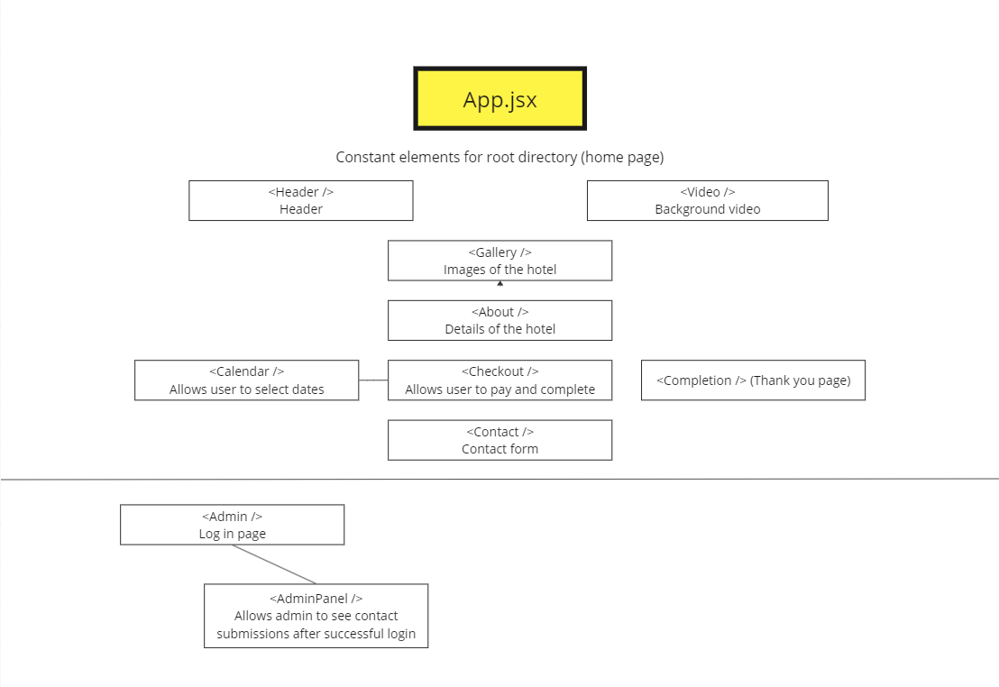

# Frontend Personal Project

## Planning

## Tech stack

For this project I used React and a JSON server.

## Why this stack

It's what we've been learning for a while and I have a good understanding of it now. I find it easy to use with things like Routes, Route, Link, useNavigate, and various hooks.

## What I enjoyed

I enjoyed laying out the page and figuring out more advanced things like creating a functional calendar which looks good. I enjoyed making a backend page which displays data that was posted from the contact form. If a user submits a contact inquiery, it will display in the contact page. I also enjoyed implementing the animated text that appears on the front page.

## What I found challenging

Creating a system where dates booked are blanked out on the calendar when revisiting the home page. I couldn't quite figure out how to do this but it would be nice.

## Links

[Deployed website](https://maldives-hotel123.netlify.app/) (It may take a minute to load all assets due to slow servers)

[My Github repo](https://github.com/irlydo/maldives-hotel)
